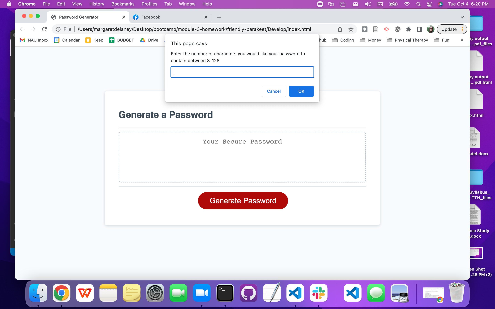
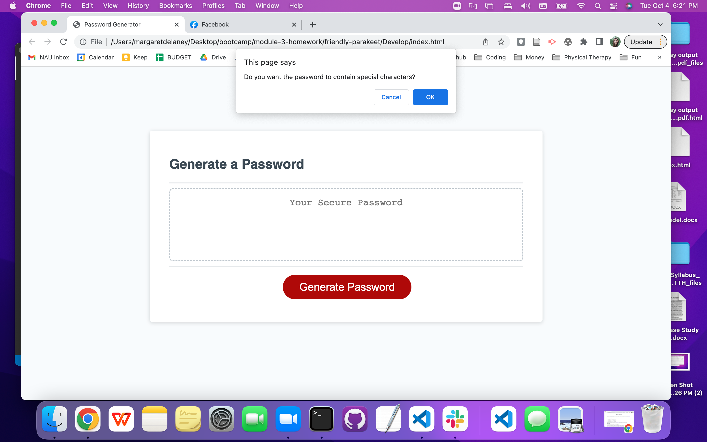

# Module 3 Homework: Password Generator

## Description

This homework focused on utilizing Javascript to create a random password generator. The homework helped me familirize myself with specific Javascript tools such as: arrays, array manipulation, variables, functions, if statements, loops, confirm and prompt functions, as well as event listeners.

The homework this week meets the following acceptance criteria:
- WHEN I click the button to generate a password, THEN I am presented with a series of prompts for password criteria
    - There is an addEventListener attached to the "Generate Password" button that flows to the writePassword function, which calls the generatePassword function, which calls the passwordOptions function where the prompts are stored. First is a prompt for desired password length, and then a series of confirm functions for the desired character types.

- WHEN prompted for password criteria, THEN I select which criteria to include in the password
    - The user will first be prompted to select a password length with the prompt function
    - The user will then be prompted to select from 4 different character sets (lowercase, uppercase, numners, or special characters) from which all or as little as one can be selected
    - If the user does not select any character types, or selects a number of characters outside the range of 8-128, they will be prompted to select an appropriate number and select at least 1 character set

- WHEN prompted for the length of the password, THEN I choose a length of at least 8 characters and no more than 128 characters
    - If the user selects a number between 8 and 128, it is accepted and used as the desired password length
    - If the user selects a number outside the range of 8-128, they are prompted to try again with an appropriate number
    - If they tries a character that is not a number, they are again prompted to try again with an appropriate number
    -   var length = prompt("Enter the number of characters you would like your password to contain between 8-128")
         if (length < 8 || length > 128 || isNaN(length) === true)
         prompt("Please enter a valid number between 8 and 128.")

- WHEN asked for character types to include in the password, THEN I confirm whether or not to include lowercase, uppercase, numeric, and/or special characters
    - The user will then see 4 confirm messages pop up asking the user to confirm if they would like to use lowercase, uppercase, numbers, or special characters (or cancel if not)
    - Example: var userLowerChoice = confirm("Do you want the password to contain lower case?")

- WHEN I answer each prompt, THEN my input should be validated and at least one character type should be selected
    - In the event the user does not select one character set, they are prompted to please select at least one to proceed
    -   if (userLowerChoice === false &&
        userUpperChoice === false &&
        userNumberChoice === false &&
        userSpecialChoice === false) {
        alert("Please select at least one character set for the password")
        return null

- WHEN all prompts are answered, THEN a password is generated that matches the selected criteria
    - Once the user selects the length of the password and the character sets, the selections are then concatenated into an empty array where the options are held. Then, using randomization within the parameter of password length set by the user, random characters will be selected out of the empty array into a temporary array. Then the temporary array is returned to passwordOptions, where it is in turn called to generatePassword and turned into a string, and then to writePassword and ultimately displayed on the page.

- WHEN the password is generated, THEN the password is either displayed in an alert or written to the page
    - The random password is then populated to the page

## Installation

The following steps were taken to install this project:
1. Create variables containing arrays of all the possible options within a character set (lowercase, uppercase, number, and special)
2. Create an empty array for adding in user selections
3. Function "writePassword" calls the "generatePassword" function, which calls "passwordOptions" which is where the user input starts
4. Function "passwordOptions" uses a prompt to collect the user's desired password length, parameters are put in place using an if statement to prevent the user from picking a password less than 8 characters or over 128 characters, or picking a non-integer
5. Then, confirm messages are sent out for each character set, allowing the user to "confirm" that "yes" they want that character set, or selecting "cancel" as a "no"
6. An if statement is used to ensure the user has selected at least 1 character set
7. Once the user has made their selections, a series of if statements are used to concatenate the selected character set arrays with the empty array
8. A new variable called "temporaryArray" is created empty, within this cariable, a while loop is used to define the length of the array as whatever length the user selected
9. Then, a variable "index" is created to randomize the empty array where all the user selected character sets live
10. The random selections are then pushed to the temporary array as a new array, this contains the password, however in array form
11. The password array (temporaryArray) is then returned, where it is then called back up to function "generatePassword" as new variablew newpass
12. newpass is then converted from an array into a string, and returned
13. The newpass string is then called to function "writePassword" where it is displayed to the page

## Usage

To begin using this random password generator, follow the instructions below:

1. Click "Generate Password" button

2. You will be prompted to pick a password length between 8 and 128, please type in the desired length

    

3. You will be prompted to "confirm" if you want lowercase

    

4. You will be prompted to "confirm" if you want uppercase

    

5. You will be prompted to "confirm" if you want numbers

    

6. You will be prompted to "confirm" if you want special characters

    

7. You will then see a random password that fits your set parameters populate into the box
image

    

## Credits

- W3Schools https://www.w3schools.com
- Javascript.info
- https://developer.mozilla.org/en-US/docs/Web/JavaScript

## License

MIT License

Copyright (c) 2022 maggierdelaney

Permission is hereby granted, free of charge, to any person obtaining a copy
of this software and associated documentation files (the "Software"), to deal
in the Software without restriction, including without limitation the rights
to use, copy, modify, merge, publish, distribute, sublicense, and/or sell
copies of the Software, and to permit persons to whom the Software is
furnished to do so, subject to the following conditions:

The above copyright notice and this permission notice shall be included in all
copies or substantial portions of the Software.

THE SOFTWARE IS PROVIDED "AS IS", WITHOUT WARRANTY OF ANY KIND, EXPRESS OR
IMPLIED, INCLUDING BUT NOT LIMITED TO THE WARRANTIES OF MERCHANTABILITY,
FITNESS FOR A PARTICULAR PURPOSE AND NONINFRINGEMENT. IN NO EVENT SHALL THE
AUTHORS OR COPYRIGHT HOLDERS BE LIABLE FOR ANY CLAIM, DAMAGES OR OTHER
LIABILITY, WHETHER IN AN ACTION OF CONTRACT, TORT OR OTHERWISE, ARISING FROM,
OUT OF OR IN CONNECTION WITH THE SOFTWARE OR THE USE OR OTHER DEALINGS IN THE
SOFTWARE.